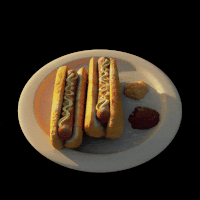
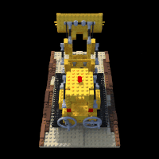
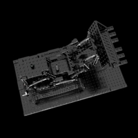
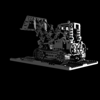
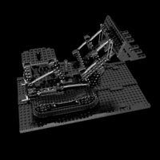
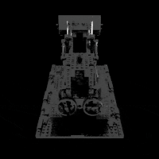

# pointRF

This repository provides a simple **differentiable point-based radiance fields** rasterization framework for novel view synthesis, orders of magnitude **faster** than traditional volume-based NeRF methods.

**pointRF** is a simple and naive coarse-to-fine optimization pipeline, extending on [recent differentiable point surface-splatting](https://arxiv.org/abs/1912.08804) techniques. Point locations and colors are incrementally learned via propagation of gradients from target images back to the 3D scene. While the procuded imagery does not achieve state-of-the-art quality, novel views are rendered at interactive speeds and the learned point clouds can directly be saved as **ply** files.

<p align='center'>
  
  
  
  
  <br>
  <b>
  Char, hotdog and lego scenes (diffuse RGB points) and ficus scene (view-dependent points)
  </b>
</p>

Point colors can either be learned as static diffuse values or as view-dependent properties. In the latter case, view dependencies are fitted via optimisation of deep features fed to a simple MultiLayer Perceptron (MLP). Note that the MLP is not capable of fully overfitting to the target images and suffers from undesired view artefacts, as visibile in the above renders. Future releases of this code might mititgate this limitation by incorporating spherical harmonics, following the idea proposed by [Zhang et al.](https://arxiv.org/abs/2205.14330)


## Installations

Clone this repository and install the dependencies with the below commands.
```bash
git clone https://github.com/maximeraafat/pointRF.git
pip install -r pointRF/requirements.txt
```

The point-based rendering framework utilises [PyTorch3D](https://pytorch3d.org). Checkout the steps described in their provided [installation instruction set](https://github.com/facebookresearch/pytorch3d/blob/main/INSTALL.md) with matching versions of **PyTorch**, and **CUDA** if applicable.


## How to use pointRF

**pointRF** can train on a scene in a matter of a few minutes, using a set of simple commands as shown in the below example.

```bash
python pointRF/main.py --datapath <path/to/dataset> --train --saveply
```

This command will train on the images provided under `<path/to/dataset>` and will save **ply** files additionally to PyTorch checkpoints. Testing (while additionally saving a test GIF file) can be done in a similar fashion.

```bash
python pointRF/main.py --datapath <path/to/dataset> --test --testgif
```

A detailled description of each available option is provided in the next toggled subsections.


<details>
<summary> <b>Training and testing options</b> </summary>

---
* `--datapath` : path to the directory containing training, testing and optionally validation images and camera poses as `transforms_train/test/val.json` respectively
* `--train` : whether to train the pointRF model
* `--test` : whether to create testing images and evaluate their **PSNRs** against the ground truth test images
* `--testgif` : whether to create a GIF file from the testing images
* `--testoutput` : path to the directory in which the testing images will be stored (by default set to `test/`)
* `--testmdodel` : path to a PyTorch **pth** model checkpoint file to be used for testing (by default, the last saved checkpoint will be used)

Note that the `--test` option does not require any training parameters, since these will be adjusted given the provided checkpoint file.
</details>

<details>
<summary> <b>Saving options</b> </summary>

---
* `--savepath` : path to the directory in which the model checkpoints will be stored (by default set to `save/`)
* `--saveply` : whether to additionally save the point clouds as **ply** files

</details>

<details>
<summary> <b>Training parameters</b> </summary>

---
* `--epochs` : number of training epochs (by default set to `30000`)
* `--valfreq` : validation frequency during training (by default set to `1000`, if applicable)
* `--savefreq` : save frequency of the model checkpoint, and **ply** files if applicable (by default set to `1000`)
* `--background` : background color as a list of 3 float values inside a string (by default set to black)
* `--imagesize` : dimensions of the resized images during training (by default the images are unchanged)
* `--npoints` : initial number of points (by default set to `100`) ; the model will progressively add points until reaching the million points
* `--initlr` : initial learning rate (by default set to `1e-2`) ; the optimiser will progressively decrease it when making no further progress
* `--radius` : initial point radius (by default set to `0.1`) ; the model will progressively decrease the radius
* `--finalradius` : final point radius (by default set to `None`) ; the last epochs will train with this radius
* `--radiance` : whether to learn view-dependent colors for each point instead of static RGB point colors

We suggest using a small `--imagesize` (for instance `256`), since larger resolutions will significantly slow down rendering, and therefore training. No matter what, the model will automatically fall back to the full image resolution once it converged at the set `--imagesize`.

</details>

Notice that the python script loading the nerf camera poses (`loadnerf.py`) has only been tested with scenes extracted from Blender, and might need to be adapted to be functional with real world data.

In addition to this code, we provide a dataset consisting of the specular reflections passes of the LEGO scene obtained from the original [synthetic NeRF](https://drive.google.com/drive/folders/128yBriW1IG_3NJ5Rp7APSTZsJqdJdfc1) dataset. The dataset was created using [BlenderNeRF](https://github.com/maximeraafat/BlenderNeRF).

[DOWNLOAD LEGO SPECULAR DATASET](https://drive.google.com/file/d/1xflxoBpqGU05A2gvyPjwM-tO8VORbpIb/view?usp=share_link)

<p align='center'>
  
  
  
  
  <br>
  <b>
  3 random views form the LEGO specular training data, and our test views reconstruction
  </b>
</p>
